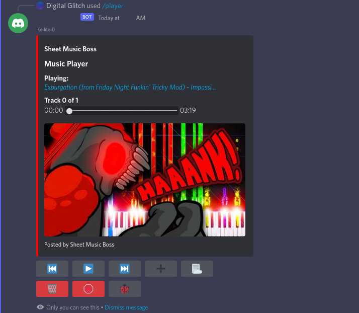

# <a href="#"></a>

# Discord Bot

An easy-to-use Discord Music Player.

> This is a work-in-progress Music Player for Discord voice chat servers. 

> 

## How It Works

We register the Discord bot into a voice channel, then any user can run the 
`/player` command to bring-up a card with the music player. The bot acts like
a singleton inside of a voice channel, that is to say there will only ever be
one. Any user in the voice channel can view and use the player UI, with which
can optionally be restricted with some configuration options.  


### Build & Run

To run the discord Music Player bot yourself, run the command:

```sh
# install or update dependencies
npm install

# build and serve the project in browser
npm start
```
> NOTE: you can optionally use the `.vscode/launch.json` file to interactively
> run and debug the bot. This is the recommended approach for debugging issues
> and developing new features.


Now see the bot register it's endpoints with discord which tells us that the 
program is loaded and initialized. Look for the `music player#1234 is running` 
message.

> NOTE: if you are debugging with the VS Code `launch.json` file, there is no
> watch with automatic rebuild, so you'll have to reload the process to see the
> changes you make.

